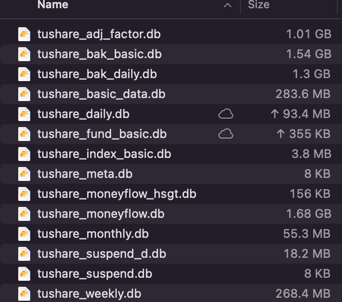

# Tutake

Take data from Tushare, respect Tushare!

1. 支持定时自动化的下载tushare数据，保证数据的同步
2. 支持本地的数据查询，性能和效率更高（当前使用sqlite,后续计划支持多类型数据库）
3. 支持原生的查询，分析的维度更灵活（sql还是很强大的）
4. 支持接口的扩展，常用的数据组合接口可以通过扩展的方式统一调用(目前增加了雪球热榜的接口)
5. 支持架设数据私服，提供私有化的数据服务

## 背景

> 最近发现量化是件有趣的事情，但相关数据的采集是件颇为棘手的事情，幸亏有Tushare， 可发现需要进行全市场的回测远程的接口性能还是有点弱，所以思考如何把数据存储到本地

## 实现

> 因为Tushare api及doc完整度非常高，就有了本项目的想法和实践--基于Tushare的api
> doc自动化的生成Tushare数据的全量同步及增量更新的代码，复用Tushare接口查询本地数据，同时支持定时执行数据同步。

## 使用

### Step1 设置配置文件

clone 代码后复制配置文件 `config-default.yml` -> `config.yml`
需要配置两个参数：

```yaml
#执行时需要将这个文件调整为 config.yml
tutake:
  data:
    dir: ~/.tutake/data  #单独指定数据的目录
  scheduler:
    tasks:  #配置每个任务的定时任务，使用crontab的参数，具体的配置参考下方注释或者上网查询
      - xueqiu: 0 10 * * *  #代表xueqiu的所有接口都用这个cron参数
      - default: 5 0 * * *  #default代表没有指定的任务都默认用这个cron参数
      - stock_basic: 0 0,11,21 * * *
      - fund_basic: 0 0,11,21 * * *
      - index_basic: 0 0,11,21 * * *
      - anns:   #如果cron参数为空,代表这个任务不执行

      # *    *    *    *    *
      # -    -    -    -    -
      # |    |    |    |    |
      # |    |    |    |    +----- day of week (0 - 7) (Sunday=0 or 7) OR sun,mon,tue,wed,thu,fri,sat
      # |    |    |    +---------- month (1 - 12) OR jan,feb,mar,apr ...
      # |    |    +--------------- day of month (1 - 31)
      # |    +-------------------- hour (0 - 23)
      # +------------------------- minute (0 - 59)

tushare:
  token: #tushare api 的token，如果需要获取所有的数据，需要5000以上的积分

```

具体的api的使用，可以直接参考代码 <a href="main.py">main.py</a>，包含下面的所有演示的代码

### Step2 快速上手
同步股票列表数据到本地，并查询股票列表
```python
import tutake as tt

if __name__ == '__main__':
    tutake = tt.Tutake("./config.yml")
    print("========同步股票数据========")
    tutake.process_api().stock_basic()
    print("========查询股票数据========")
    print(tutake.tushare_api().stock_basic())
```
```python
========同步股票数据========
[20:43:29] Start TushareStockBasic process.                                                                                              process.py:54
2023-01-06 20:43:29,834 - api.tushare.stock_basic - WARNING - Delete all data of tushare_stock_basic
[20:43:31] (stock_basic-33.33%) Fetch and append data, cnt is 5068 param is {'list_status': 'L'}                                 process_report.py:214
           (stock_basic-66.67%) Fetch and append data, cnt is 192 param is {'list_status': 'D'}                                  process_report.py:214
           (stock_basic-100.00%) Fetch and append data, cnt is 0 param is {'list_status': 'P'}                                   process_report.py:214
           Finished TushareStockBasic process. it takes 1.219354s                                                                       process.py:100
========查询股票数据========
        ts_code  symbol      name  area  ... list_status list_date delist_date is_hs
0     000001.SZ  000001      平安银行    深圳  ...           L  19910403        None     S
1     000002.SZ  000002       万科A    深圳  ...           L  19910129        None     S
2     000003.SZ  000003  PT金田A(退)  None  ...           D  19910703    20020614     N
3     000004.SZ  000004      ST国华    深圳  ...           L  19910114        None     N
4     000005.SZ  000005      ST星源    深圳  ...           L  19901210        None     N
...         ...     ...       ...   ...  ...         ...       ...         ...   ...
5255  873223.BJ  873223      荣亿精密  None  ...           L  20220609        None     N
5256  873305.BJ  873305      九菱科技  None  ...           L  20221221        None     N
5257  873339.BJ  873339      恒太照明  None  ...           L  20221117        None     N
5258  873527.BJ  873527       夜光明  None  ...           L  20221027        None     N
5259  T00018.SH  T00018   上港集箱(退)  None  ...           D  20000719    20061020     N

[5260 rows x 15 columns]
```


### Step3 下载股票列表
执行main函数，开始同步下载数据

```python
import tutake as tt

if __name__ == '__main__':
    tutake = tt.Tutake("./config.yml")
    
    #后面两个的demo接口数据量很大，耗时很长，可以先尝试小数据量的接口，比如stock_basic
    tutake.process_api().stock_basic()  
    
    # 通过以下的方式进行数据的同步，两种方式均可以同步数据
    tutake.task_api().start(True)  # 启动全量的数据同步任务，第一次执行的耗时非常长
    tutake.process_api().daily()  # 单个接口的数据同步，daily的数据量比较大
```

### Step4 查询数据
下载完数据就可以从本地查询数据:

```python
import tutake as tt

if __name__ == '__main__':
    tutake = tt.Tutake("./config.yml")
    # 通过以下的方式进行数据的查询
    ts_api = tutake.tushare_api()
    print(ts_api.apis())  # 所有支持的api
```
显示支持的apis：
```python
['adj_factor', 'stock_company', 'daily', 'moneyflow', 'bak_daily', 'namechange', 'fund_basic', 'monthly', 'moneyflow_hsgt', 'stk_rewards', 'hs_const', 'bak_basic', 'suspend_d', 'weekly', 'stock_basic', 'new_share', 'stk_managers', 'daily_basic', 'ggt_daily', 'ggt_top10', 'hsgt_top10', 'ggt_monthly', 'income_vip', 'balancesheet_vip', 'cashflow_vip', 'forecast_vip', 'express_vip', 'dividend', 'fina_indicator_vip', 'ths_daily', 'ths_member', 'anns', 'trade_cal', 'fund_adj', 'fund_company', 'fund_div', 'fund_manager', 'fund_nav', 'fund_portfolio', 'fund_sales_ratio', 'fund_sales_vol', 'fund_share', 'fund_daily', 'index_basic', 'index_daily', 'index_dailybasic', 'index_classify', 'index_member', 'ths_index', 'index_global', 'daily_full']
```

同步数据后，就可以查询`000002.SZ`的`daily`数据：
```python
import tutake as tt

if __name__ == '__main__':
    tutake = tt.Tutake("./config.yml")
    # 通过以下的方式进行数据的查询
    ts_api = tutake.tushare_api()
    print(ts_api.daily(ts_code='000002.SZ'))  # 查询000002.SZ每日数据
```

```python
        ts_code trade_date   open  ...  pct_chg         vol        amount
0     000002.SZ   19910129  14.58  ...  1358.00        3.00  2.200000e+01
1     000002.SZ   19910130  14.51  ...    -0.48       17.00  1.230000e+02
2     000002.SZ   19910204  14.66  ...     0.48       56.00  4.100000e+02
3     000002.SZ   19910205  14.73  ...     0.48       29.00  2.130000e+02
4     000002.SZ   19910206  14.80  ...     0.48       29.00  2.150000e+02
...         ...        ...    ...  ...      ...         ...           ...
5995  000002.SZ   20160824  24.40  ...    -2.87  1470675.59  3.561540e+06
5996  000002.SZ   20160825  23.50  ...    -1.88  1821374.91  4.234199e+06
5997  000002.SZ   20160826  23.59  ...    -2.76  1200024.09  2.780659e+06
5998  000002.SZ   20160829  22.86  ...     0.09   782446.19  1.796321e+06
5999  000002.SZ   20160830  22.95  ...    -1.09   909262.53  2.072873e+06

[6000 rows x 11 columns]
```

使用`pro_bar`接口获取更复杂的数据，例如获得`000002.SZ`的后复权数据：
```python
import tutake as tt

if __name__ == '__main__':
    tutake = tt.Tutake("./config.yml")
    # 通过以下的方式进行数据的查询
    ts_api = tutake.tushare_api()
    print(ts_api.pro_bar(ts_code='000002.SZ', adj='hfq'))  # 查询000002.SZ的后复权数据
```
```python
        ts_code trade_date       open  ...    pct_chg         vol        amount
0     000002.SZ   19910129   100.5728  ...  1357.9994        3.00  2.200000e+01
1     000002.SZ   19910130   100.0900  ...    -0.4801       17.00  1.230000e+02
2     000002.SZ   19910204   101.1247  ...     0.4798       56.00  4.100000e+02
3     000002.SZ   19910205   101.6075  ...     0.4774       29.00  2.130000e+02
4     000002.SZ   19910206   102.0904  ...     0.4753       29.00  2.150000e+02
...         ...        ...        ...  ...        ...         ...           ...
5995  000002.SZ   20160824  3239.8808  ...    -2.8745  1470675.59  3.561540e+06
5996  000002.SZ   20160825  3120.3770  ...    -1.8758  1821374.91  4.234199e+06
5997  000002.SZ   20160826  3132.3274  ...    -2.7613  1200024.09  2.780659e+06
5998  000002.SZ   20160829  3035.3965  ...     0.0874   782446.19  1.796321e+06
5999  000002.SZ   20160830  3047.3469  ...    -1.0912   909262.53  2.072873e+06

[6000 rows x 11 columns]
```

原生sql查询

一些特殊场景下需要需要更多维度的查询，所以也支持使用sql查询。
只需要通过接口前加上_就可以，比如股票日数据`daily`接口可以用`_daily`来访问
```python
import tutake as tt

if __name__ == '__main__':
    tutake = tt.Tutake("./config.yml")
    # 通过以下的方式进行数据的查询
    ts_api = tutake.tushare_api()
    print(ts_api._daily.sql("select * from {table} where trade_date='20221230' and close>open limit 5"))  # 通过sql直接查询数据
```
```python
    ts_code trade_date  open  high  ...  change  pct_chg        vol      amount
0  002198.SZ   20221230  6.39  6.57  ...    0.12   1.8750  101579.12   65646.164
1  002199.SZ   20221230  6.36  6.43  ...    0.10   1.5898   38684.00   24640.014
2  002194.SZ   20221230  9.13  9.26  ...    0.11   1.2088  101101.41   92895.425
3  002181.SZ   20221230  5.28  5.52  ...    0.15   2.8249  547665.70  297495.407
4  002195.SZ   20221230  1.99  2.02  ...    0.03   1.5152  444728.72   89088.620

[5 rows x 11 columns]
```

也可以查看接口的元数据：
```python
import tutake as tt

if __name__ == '__main__':
    tutake = tt.Tutake("./config.yml")
    # 通过以下的方式进行数据的查询
    ts_api = tutake.tushare_api()
    print(ts_api._daily.meta())  # 查看接口元数据
```
结果如下：
```json
{'table_name': 'tushare_daily', 'columns': [{'name': 'ts_code', 'type': 'String', 'comment': '股票代码'}, {'name': 'trade_date', 'type': 'String', 'comment': '交易日期'}, {'name': 'open', 'type': 'Float', 'comment': '开盘价'}, {'name': 'high', 'type': 'Float', 'comment': '最高价'}, {'name': 'low', 'type': 'Float', 'comment': '最低价'}, {'name': 'close', 'type': 'Float', 'comment': '收盘价'}, {'name': 'pre_close', 'type': 'Float', 'comment': '昨收价'}, {'name': 'change', 'type': 'Float', 'comment': '涨跌额'}, {'name': 'pct_chg', 'type': 'Float', 'comment': '涨跌幅'}, {'name': 'vol', 'type': 'Float', 'comment': '成交量'}, {'name': 'amount', 'type': 'Float', 'comment': '成交额'}], 'default_order_by': 'trade_date,ts_code', 'default_limit': '6000'}
```

额外还有雪球的一些接口支持：
```python
import tutake as tt

if __name__ == '__main__':
    tutake = tt.Tutake("./config.yml")

    xq_api = tutake.xueqiu_api()
    print(xq_api.apis())  # 雪球所有支持的api
    print(xq_api.index_valuation())  # 指数的每日估值
    print(xq_api._index_valuation.meta())  # 指数的每日估值元数据

```
```python
        ts_code trade_date  name  ttype  ...      pb     roe   yeild  eva_type
0    399986.SZ   20221213  中证银行      3  ...  0.5364  0.1178  0.0569       low
1    000015.SH   20221213  上证红利      2  ...  0.5871  0.1203  0.0713       low
2    CSIH30269   20221213  红利低波      2  ...  0.5873  0.1198  0.0690       low
3     SPACEVCP   20221213  标普价值      2  ...  0.5266  0.1011  0.0585       low
4    000922.SH   20221213  中证红利      2  ...  0.6340  0.1181  0.0643       low
..         ...        ...   ...    ...  ...     ...     ...     ...       ...
763  CSI931079   20230106  5G通讯      3  ...  2.7255  0.1181  0.0127    unsort
764   HKHSSCNE   20230106   新经济      2  ...  3.1623  0.1097  0.0087    unsort
765  CSI931087   20230106  科技龙头      3  ...  4.7646  0.1417  0.0062    unsort
766  000688.SH   20230106  科创50      1  ...  4.4710  0.1058  0.0039    unsort
767   HKHSTECH   20230106  恒生科技      3  ...  2.9211  0.0556  0.0044    unsort

[768 rows x 12 columns]
```

### 架设私服
因为sqlite不支持C/S结构，为了能方便本地访问测试，又不需要同步数据到本地，所以可以在服务器上假设一个Tutake代理服务
并添加配置项：
```yaml
tushare.remote.server: tcp://xxx.xxx:5000
```
如果要启动私服数据服务：
添加配置：
```yaml
tushare.server.port: 5000
```
并启动远程服务
```python
RemoteServer(tutake).start(True)
```


## 说明
因为数据量比较大，全量的数据超过百G，但是tushare有限速限量的各种约束，所以建议使用多个高等级的账号（5000积分以上的账号），工程支持配置多个账号，然后自动适配限流下载，全量数据下载完后，每天的增量数据量很小，通常10分钟内下载完毕，
目前调试的接口是按照个人需要生成的，还有很多接口没有生成，如果有需要的可以留言，或者阅读代码自行添加。目前的接口基本覆盖了股票、基金、指数、期货相关的接口

## 关于数据
基本一个接口会有一个数据文件，但是数据文件会比较大，如果有人想直接要这个数据，也可以加Star留言，后续数据稳定了，会发布历史数据供大家一次性下载。同时也计划开发定期增量数据更新的功能(日/周/月/季度/年)，解决大家账号低权限无法下载的问题。




## 计划
目前距离生产可用性的距离还很远，但是希望能不断优化接近高可用，当然还有更多的功能也会不断增加
